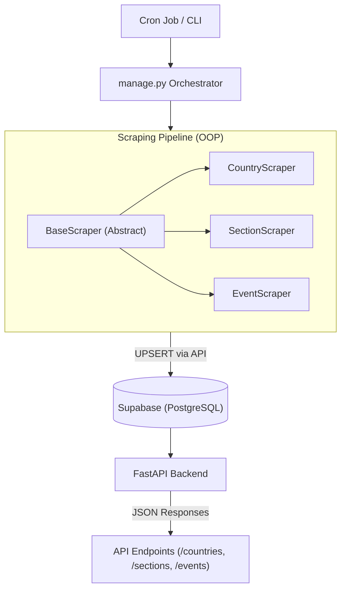
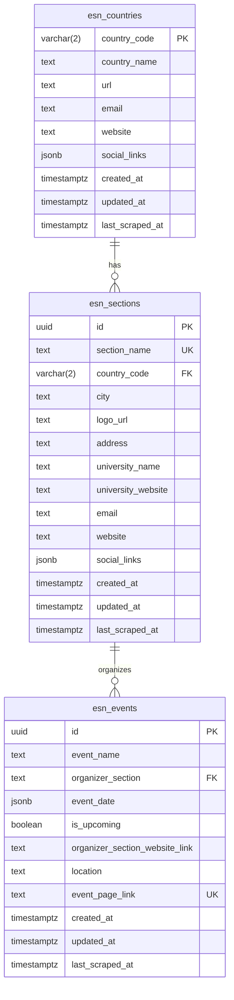

# ESN Activities API

Welcome to the **ESN Activities API**! This project provides a robust, fully automated, and modular scraping pipeline paired with a modern backend to extract, store, and serve data related to the Erasmus Student Network (ESN) Activities.

## 🚀 Project Overview & Tech Stack

The platform programmatically harvests ESN's global structure—countries, local sections, and upcoming/past activities—and serves it via a lightning-fast REST API.

**Tech Stack:**
- **Language:** Python 3 (Typing, Async/Await)
- **Dependency Management:** [uv](https://github.com/astral-sh/uv) (Extremely fast Python package installer and resolver)
- **Web Framework:** [FastAPI](https://fastapi.tiangolo.com)
- **Database:** PostgreSQL via [Supabase](https://supabase.com)
- **Web Scraping:** `httpx` and `BeautifulSoup4` (Asynchronous HTTP & HTML Parsing)
- **CI/CD & Automation:** GitHub Actions (for cron jobs)

---

## 🏗 Architecture Overview

The system runs on two primary engines: an **Asynchronous Scraping Pipeline** (CLI Orchestrated) and a **FastAPI backend**. The scrapers fetch unstructured data, clean it utilizing an OOP-based blueprint, and confidently `UPSERT` it to Supabase. FastAPI then reliably serves this living data.



---

## 🗄 Database Schema

The foundation of the API is a strictly typed relational schema stored in Supabase holding three main tables:


*Note: Audit columns (`created_at`, `updated_at`, `last_scraped_at`) guarantee that we track data freshness on every scraper run.*

---

## ⚙️ How It Works (The Scraping Pipeline)

The data pipeline adopts a robust **Object-Oriented Programming (OOP)** design:

1. **`BaseScraper`:** An abstract class (`src/scrapers/base_scraper.py`) that enforces all child scrapers to implement specific stages.
2. **`fetch_data()`**: Asynchronously calls ESN endpoints, handling pagination, timeouts, and throttling.
3. **`parse_data()`**: Cleans, parses, and normalises raw HTML/JSON structures into standard dictionaries.
4. **`save_to_json()`**: An inherited concrete utility to optionally cache scrapped data strictly as local JSON files for debugging/archival.
5. **`upsert_to_db()`**: Synchronises state to PostgreSQL. Supabase effectively resolves conflicts using an `UPSERT` command (e.g., matching on `event_page_link`). If it exists, it updates; if not, it creates.

---

## 🛠 Installation & Setup

Get started locally in minutes using `uv`.

**1. Clone the repository:**
```bash
git clone https://github.com/your-username/ESN-Activities-API.git
cd ESN-Activities-API
```

**2. Install dependencies with `uv`:**
```bash
# If you don't have uv installed, install it first:
# curl -LsSf https://astral.sh/uv/install.sh | sh

# Install project dependencies
uv sync
```

**3. Configure Environment Variables:**
You need a Supabase backend to connect to. Copy the example `.env` file and insert your keys.
```bash
cp .env.example .env
```
Inside your `.env` file, specify:
```ini
SUPABASE_URL=https://your-project-id.supabase.co
SUPABASE_KEY=your-supabase-service-role-key-or-anon-key
```

---

## Usage & API Reference

### Populating the database (CLI)

Use the management CLI to scrape public ESN data into Supabase. From the project root:

```bash
uv run manage.py scrape --target <target>
```

Ensure `SUPABASE_URL` and `SUPABASE_KEY` are set (for example in `.env`).

#### Scrape targets

| Target | What it does |
|--------|--------------|
| `countries` | Crawls **accounts.esn.org** for ESN **national organisations**, parses each country page, and **upserts** rows into the `esn_countries` table. |
| `sections` | Crawls **accounts.esn.org** for **local ESN sections**, links them to country codes, and **upserts** into `esn_sections`. |
| `events` | Reads the paginated global activities feed at **activities.esn.org** (`?page=N`), follows each activity, enriches detail fields, and **upserts** into `esn_events`. |
| `all` | Runs the three scrapers **in order**: **countries → sections → events**, so foreign-key relationships stay consistent. |

#### Optional flags

| Flag | Applies to | Default | Description |
|------|------------|---------|-------------|
| `--limit` | `countries`, `sections` | `0` | Maximum number of URLs to process; **`0` means no cap (all)**. |
| `--start-page`, `--end-page` | `events` | `0` | Inclusive page index range for the activities feed. |
| `--concurrency` | `events` | `10` | Maximum concurrent HTTP requests while scraping events. |
| `--continue-on-empty` | `events` | off | Keep paging when a feed page returns **zero** events (default is to stop). |
| `--archive` | all targets | off | Write scraped payloads to JSON files under the `data/` directory (`countries.json`, `sections.json`, or `events.json`). |

Example:

```bash
uv run manage.py scrape --target events --start-page 0 --end-page 5 --concurrency 10
```

---

### REST API

After installing dependencies, run the server locally:

```bash
uv run python main.py
# API: http://localhost:8000
# Swagger UI: http://localhost:8000/docs
```

JSON resources are under **`/api/v1`** (plus **`GET /`** for a short welcome message). Every route in the table uses **`GET`**. Interactive API docs: **`/docs`** (Swagger UI).

| Method | Path | Description |
|--------|------|-------------|
| GET | `/` | Welcome payload with a pointer to `/docs`. |
| GET | `/api/v1/health` | Service health and latest scrape timestamp across tables. |
| GET | `/api/v1/countries` | All national organisations. |
| GET | `/api/v1/countries/{country_code}/sections` | Sections for one country (ISO alpha-2 code). |
| GET | `/api/v1/sections` | Local sections with optional city filter. |
| GET | `/api/v1/events` | Global events feed with filters and pagination. |

#### `GET /api/v1/health`

- **Returns:** JSON with `status` (e.g. `"ok"`) and `last_sync_time` (ISO 8601 string or `null`). `last_sync_time` is the latest `last_scraped_at` found across `esn_countries`, `esn_sections`, and `esn_events`.
- **Errors:** `503` if the database is unavailable.

#### `GET /api/v1/countries`

- **Returns:** `{ "status": "success", "count": <int>, "data": [ ... ] }` — all countries, sorted by **`country_name`**.
- **Query parameters:** none.

#### `GET /api/v1/countries/{country_code}/sections`

- **Returns:** Same envelope as countries; **`data`** contains all sections whose `country_code` matches **`{country_code}`** (input is treated case-insensitively; matching uses the uppercase code), sorted by **`section_name`**.
- **Path parameters:** `country_code` — ISO-style country code (e.g. `de`, `TR`).
- **Errors:** `404` if the country does not exist.

#### `GET /api/v1/sections`

- **Returns:** `{ "status": "success", "count": <int>, "data": [ ... ] }`.

| Query parameter | Type | Default | Description |
|-----------------|------|---------|-------------|
| `city` | string | *(omitted)* | Case-insensitive **substring** match on the section’s city (`%value%`). |
| `limit` | integer | `50` | Maximum rows (allowed range **1–500**). |

#### `GET /api/v1/events`

- **Returns:** `{ "status": "success", "count": <int>, "skip": <int>, "limit": <int>, "data": [ ... ] }`. Results are ordered by **`event_start_date`** descending (newer start dates first).

| Query parameter | Type | Default | Description |
|-----------------|------|---------|-------------|
| `is_upcoming` | boolean | *(omitted)* | If set, filters rows where **`is_upcoming`** equals this value (`true` = upcoming only, `false` = past only). |
| `organizer_section` | string | *(omitted)* | **Exact** match on the **`organizer_section`** field. |
| `limit` | integer | `50` | Page size (allowed range **1–100**). |
| `skip` | integer | `0` | Number of rows to skip before returning `limit` rows (offset pagination). |

There is no `city` query parameter on `/api/v1/events`; use `organizer_section` for exact section name matches.

---

### Examples (`curl`)

Replace the host with your deployment URL (local default is often `http://localhost:8000`).

**1. Health and last sync**

```bash
curl -s "http://localhost:8000/api/v1/health"
```

**2. Next five upcoming events for one organising section**

```bash
curl -s "http://localhost:8000/api/v1/events?is_upcoming=true&organizer_section=ESN%20Example%20City&limit=5&skip=0"
```

**3. Second page of events (20 per page) with no extra filters**

```bash
curl -s "http://localhost:8000/api/v1/events?skip=20&limit=20"
```

**4. Sections whose city name contains a substring**

```bash
curl -s "http://localhost:8000/api/v1/sections?city=Berlin&limit=10"
```
