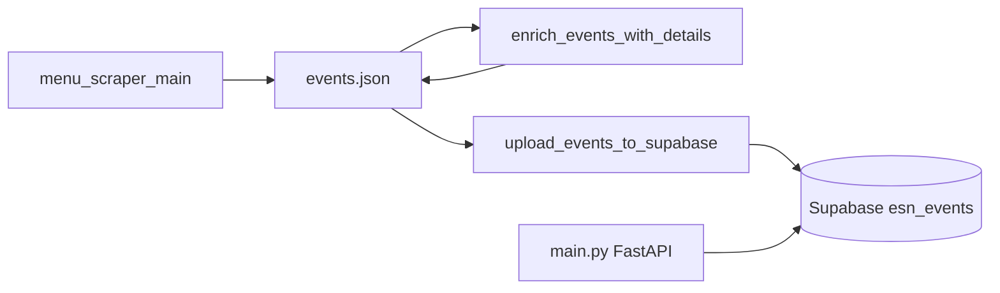

# ESN Activities API

Backend tooling and a small read API for aggregating public activity listings from [ESN’s activities site](https://activities.esn.org): scrape paginated HTML, optionally enrich each activity from its detail page, upsert rows into Supabase, and serve paginated JSON over FastAPI.

---

## Architecture

| Layer | Role |
|--------|------|
| **List scraper** | [`menu_scraper_main.py`](menu_scraper_main.py) + [`src/menu_scraper_funcs.py`](src/menu_scraper_funcs.py) request `https://activities.esn.org/activities?page=N`, parse `article.activities-mini-preview` cards, and write a JSON **array** (default [`events.json`](events.json)). |
| **Detail enricher (optional)** | [`enrich_events_with_details.py`](enrich_events_with_details.py) + [`src/detail_scraper_funcs.py`](src/detail_scraper_funcs.py) fetch each `event_page_link`, parse detail HTML into `event["details"]`, and atomically replace the JSON file. |
| **Upload** | [`upload_events_to_supabase.py`](upload_events_to_supabase.py) maps list-level fields to table rows and **upserts** on `event_page_link`. |
| **API** | [`main.py`](main.py): FastAPI application backed by Supabase; exposes `GET /api/v1/activities` with pagination. |



---

## Requirements

- **Python** `>= 3.9` (see [`pyproject.toml`](pyproject.toml)). The repo includes [`.python-version`](.python-version) pinning **3.9** for local development.
- **uv** (recommended): this project ships [`uv.lock`](uv.lock). Install dependencies with:

  ```bash
  uv sync
  ```

  Alternatively, using pip:

  ```bash
  python -m venv .venv
  source .venv/bin/activate   # Windows: .venv\Scripts\activate
  pip install -e .
  ```

### Dependencies

Runtime libraries are declared in [`pyproject.toml`](pyproject.toml), including FastAPI, httpx, python-dotenv, Supabase Python client, uvicorn, **beautifulsoup4**, and **requests** (HTML parsing and HTTP for the scrapers). After `uv sync`, all entry points—including scrapers—should import cleanly.

---

## Environment variables

Create a `.env` file in the project root (do not commit it; `.env` is listed in [`.gitignore`](.gitignore)).

| Variable | Used by | Description |
|----------|---------|-------------|
| `SUPABASE_URL` | API ([`main.py`](main.py)), upload | Supabase project URL. |
| `SUPABASE_KEY` | API | Secret key. The API reads **only** this name; use an anon key with RLS policies that allow `SELECT` on `esn_events`, or a service role if your setup expects it (understand the security implications). |
| `SUPABASE_SERVICE_ROLE_KEY` | Upload (optional) | Service role key for bulk upsert (bypasses RLS). If unset, upload falls back to `SUPABASE_KEY`. |
| `SUPABASE_KEY` | Upload | Used when `SUPABASE_SERVICE_ROLE_KEY` is not set. |

The API fails fast at import time if `SUPABASE_URL` or `SUPABASE_KEY` is missing (raises `RuntimeError` with message `SUPABASE_URL ve SUPABASE_KEY ortam değişkenleri gerekli.`). The upload script exits with a clear error if URL and key cannot be resolved.

---

## Database

Apply the migration before uploading or running the API against a new project:

- File: [`supabase/migrations/20250327120000_create_esn_events.sql`](supabase/migrations/20250327120000_create_esn_events.sql)

It creates:

- Table `public.esn_events` with columns: `id` (UUID), `event_name`, `organizer_section`, `event_date` (JSONB), `is_upcoming`, `organizer_section_website_link`, `location`, `event_page_link`, `created_at`.
- **Unique constraint** on `event_page_link` (upsert key).
- Indexes on `organizer_section` and on `(event_date->>'start')` for sorting/filtering.

Run the SQL in the Supabase SQL Editor, or use the Supabase CLI (`supabase db push`) if your workflow uses linked projects.

---

## Data model

### List event (menu scraper output)

Each element of the JSON array has roughly this shape (see [`parse_events` in `menu_scraper_funcs.py`](src/menu_scraper_funcs.py)):

| Field | Type | Description |
|-------|------|-------------|
| `event_name` | string \| null | Activity title. |
| `organizer_section` | string \| null | ESN section name from the card. |
| `event_date` | object | `{ "raw", "start", "end" }` — `start`/`end` are ISO dates (`YYYY-MM-DD`) when parsed. |
| `is_upcoming` | boolean \| null | `true` when start date is today or in the future (when parseable). |
| `organizer_section_website_link` | string \| null | Absolute URL to the organisation page. |
| `location` | string \| null | City / region line from the card. |
| `event_page_link` | string | Absolute URL to the activity; **required** for deduplication and upload. |

### Details object (after `enrich_events_with_details.py`)

When present, `details` is a dictionary aligned with [`_empty_details()` / `parse_event_details()`](src/detail_scraper_funcs.py):

| Field | Notes |
|-------|--------|
| `main_image_url` | Absolute URL or `null`. |
| `detailed_location` | String (may be empty). |
| `total_participants` | Integer or `null`. |
| `causes`, `types_of_activity`, `sdgs`, `objectives` | Lists of strings. |
| `goal_of_activity`, `description`, `outcomes` | Optional text. |
| `registration_link` | URL or `null`. |

### Upload vs. enriched JSON

[`upload_events_to_supabase.py`](upload_events_to_supabase.py) maps **only** list-level fields to `esn_events` columns. The `details` subtree is **not** written to Supabase by the current script. Enriched data lives in your JSON file unless you extend the schema and upload mapper.

---

## CLI reference

### 1. Menu scraper — [`menu_scraper_main.py`](menu_scraper_main.py)

Scrapes pages **inclusive** from `--start-page` through `--end-page` (default both `0`, i.e. a single page).

| Argument | Default | Description |
|----------|---------|-------------|
| `--start-page` | `0` | First page index. |
| `--end-page` | `0` | Last page index (inclusive). |
| `-o`, `--output` | `events.json` | Output JSON path. |
| `--no-save` | off | Print JSON to stdout only; do not write a file. |
| `--continue-on-empty` | off | Keep scanning the range even if a page returns no events. |
| `--async-fetch` | off | Use async httpx with bounded concurrency. |
| `--concurrency` | `10` | Max concurrent requests (async mode). |
| `--max-retries` | `3` | Retries for 429/502/503 and transient errors (async). |
| `--backoff-base` | `1.0` | Base seconds for exponential backoff (async). |
| `--jitter-ms` | `100` | Random jitter before requests and retries (async). |
| `--timeout` | `20` | HTTP timeout in seconds (async client). |

Examples:

```bash
# Single page (0), save to events.json
uv run python menu_scraper_main.py

# Pages 0–5, async with higher concurrency
uv run python menu_scraper_main.py --start-page 0 --end-page 5 --async-fetch --concurrency 15 -o events.json
```

### 2. Detail enricher — [`enrich_events_with_details.py`](enrich_events_with_details.py)

Fetches each `event_page_link` and sets `event["details"]`, then replaces the JSON file atomically. **Back up large files first**, e.g. `cp events.json events.json.bak` (the script also prints a reminder).

| Argument | Default | Description |
|----------|---------|-------------|
| `-f`, `--file` | `events.json` | Input/output JSON path. |
| `--limit` | `0` | If `> 0`, only process this many events from `--offset`. |
| `--offset` | `0` | Index of first event to consider. |
| `-c`, `--concurrency` | `40` | Max concurrent HTTP requests. |
| `--max-retries` | `3` | Retries on rate limits / transient errors. |
| `--backoff-base` | `1.0` | Backoff base (seconds). |
| `--jitter-ms` | `100` | Jitter in milliseconds. |
| `--timeout` | `20` | Per-request timeout (seconds). |
| `--progress-every` | `100` | Progress log interval (completed fetches). |
| `--skip-existing` | off | Skip events whose `details` already look populated (resume-friendly). |

Examples:

```bash
# Dry run on two events (good for testing)
uv run python enrich_events_with_details.py --limit 2 --concurrency 10

# Resume: skip rows that already have rich details
uv run python enrich_events_with_details.py --skip-existing --concurrency 20
```

### 3. Upload to Supabase — [`upload_events_to_supabase.py`](upload_events_to_supabase.py)

| Argument | Default | Description |
|----------|---------|-------------|
| `-f`, `--file` | `events.json` | JSON array to load. |
| `-t`, `--table` | `esn_events` | Target table name. |
| `--batch-size` | `500` | Rows per upsert request. |
| `--limit` | `0` | If `> 0`, only first N events (testing). |
| `--dry-run` | off | Parse and map rows; print summary; no Supabase calls. |

Example:

```bash
uv run python upload_events_to_supabase.py --dry-run
uv run python upload_events_to_supabase.py -f events.json --batch-size 500
```

---

## Running the API

From the repository root:

```bash
uv run python main.py
```

This starts **uvicorn** with `reload` on host `0.0.0.0` and port **8000** (see [`main.py`](main.py)).

Equivalent:

```bash
uv run uvicorn main:app --host 0.0.0.0 --port 8000 --reload
```

- **Root** [`GET /`](http://localhost:8000/): short JSON welcome message pointing to interactive docs.
- **OpenAPI / Swagger UI**: [`GET /docs`](http://localhost:8000/docs).

---

## HTTP API

### `GET /api/v1/activities`

Returns paginated rows from `esn_events`, ordered by `event_date->>start` **descending** (newer start dates first).

| Query parameter | Type | Default | Constraints |
|-----------------|------|---------|-------------|
| `limit` | integer | `50` | `1`–`100` |
| `offset` | integer | `0` | `>= 0` |

**Success response** (shape):

```json
{
  "status": "success",
  "count": 50,
  "data": [ /* array of row objects from Supabase */ ]
}
```

**Error response** (exception caught in route):

```json
{
  "status": "error",
  "message": "<error string>"
}
```

### CORS

[`main.py`](main.py) enables `CORSMiddleware` with `allow_origins=["*"]` and `allow_credentials=False` (wildcard origins are not compatible with credentialed requests in browsers).

---

## Operational notes

- **`events.json` can be very large** (hundreds of thousands of lines). Full-file load/enrich/upload uses significant memory; use `--limit` on enrich and upload for tests.
- **Scraping**: Respect the remote site’s load; tune `--concurrency`, retries, and backoff. The async paths include jitter and retries for transient HTTP errors.
- **Secrets**: Never commit `.env` or service role keys to version control.

---

## Project layout

```
.
├── main.py                      # FastAPI app
├── menu_scraper_main.py         # CLI: list scraper
├── enrich_events_with_details.py # CLI: detail enrichment
├── upload_events_to_supabase.py # CLI: bulk upsert
├── events.json                  # Default scraper output (can grow very large; consider gitignoring)
├── events3.json                 # Small sample / test payload (example)
├── src/
│   ├── menu_scraper_funcs.py    # Listing HTML parsing, sync/async fetch
│   └── detail_scraper_funcs.py  # Detail page parsing
├── supabase/migrations/         # SQL migrations
├── pyproject.toml
├── uv.lock
└── README.md
```

---

## Troubleshooting

| Symptom | What to check |
|---------|----------------|
| `RuntimeError` about `SUPABASE_URL` / `SUPABASE_KEY` | `.env` present and loaded; variable names exact for the API. |
| Upload exits with missing URL/key | Set `SUPABASE_URL` and either `SUPABASE_SERVICE_ROLE_KEY` or `SUPABASE_KEY`. |
| `ModuleNotFoundError: bs4` or `requests` | Run `uv sync` so scraper dependencies from `pyproject.toml` are installed. |
| Empty or partial scrape | Site HTML may have changed; inspect selectors in `src/menu_scraper_funcs.py` / `detail_scraper_funcs.py`. |

---

## License

No license file is included in this repository; add a `LICENSE` file if you distribute or reuse the code publicly.
