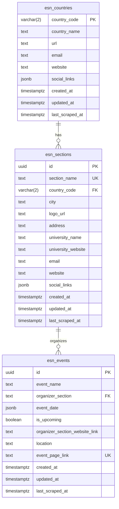

# ESN Activities API

Welcome to the **ESN Activities API**! This project provides a robust, fully automated, and modular scraping pipeline paired with a modern backend to extract, store, and serve data related to the Erasmus Student Network (ESN) Activities.

## 🚀 Project Overview & Tech Stack

The platform programmatically harvests ESN's global structure—countries, local sections, and upcoming/past activities—and serves it via a lightning-fast REST API.

**Tech Stack:**
- **Language:** Python 3 (Typing, Async/Await)
- **Dependency Management:** [uv](https://github.com/astral-sh/uv) (Extremely fast Python package installer and resolver)
- **Web Framework:** [FastAPI](https://fastapi.tiangolo.com)
- **Database:** PostgreSQL via [Supabase](https://supabase.com)
- **Web Scraping:** `httpx` and `BeautifulSoup4` (Asynchronous HTTP & HTML Parsing)
- **CI/CD & Automation:** GitHub Actions (for cron jobs)

---

## 🏗 Architecture Overview

The system runs on two primary engines: an **Asynchronous Scraping Pipeline** (CLI Orchestrated) and a **FastAPI backend**. The scrapers fetch unstructured data, clean it utilizing an OOP-based blueprint, and confidently `UPSERT` it to Supabase. FastAPI then reliably serves this living data.

```mermaid
flowchart TD
    Trigger["Cron Job / CLI"] --> Orchestrator["manage.py Orchestrator"]
    
    subgraph Scrapers["Scraping Pipeline (OOP)"]
        Base["BaseScraper (Abstract)"]
        Countries["CountryScraper"]
        Sections["SectionScraper"]
        Events["EventScraper"]
        
        Base <|-- Countries
        Base <|-- Sections
        Base <|-- Events
    end
    
    Orchestrator --> Scrapers
    Scrapers -- "UPSERT via API" --> DB[("Supabase (PostgreSQL)")]
    
    DB --> FastAPI["FastAPI Backend"]
    
    FastAPI -- "JSON Responses" --> Endpoints["API Endpoints (/countries, /sections, /events)"]
```

---

## 🗄 Database Schema

The foundation of the API is a strictly typed relational schema stored in Supabase holding three main tables:


*Note: Audit columns (`created_at`, `updated_at`, `last_scraped_at`) guarantee that we track data freshness on every scraper run.*

---

## ⚙️ How It Works (The Scraping Pipeline)

The data pipeline adopts a robust **Object-Oriented Programming (OOP)** design:

1. **`BaseScraper`:** An abstract class (`src/scrapers/base_scraper.py`) that enforces all child scrapers to implement specific stages.
2. **`fetch_data()`**: Asynchronously calls ESN endpoints, handling pagination, timeouts, and throttling.
3. **`parse_data()`**: Cleans, parses, and normalises raw HTML/JSON structures into standard dictionaries.
4. **`save_to_json()`**: An inherited concrete utility to optionally cache scrapped data strictly as local JSON files for debugging/archival.
5. **`upsert_to_db()`**: Synchronises state to PostgreSQL. Supabase effectively resolves conflicts using an `UPSERT` command (e.g., matching on `event_page_link`). If it exists, it updates; if not, it creates.

---

## 🛠 Installation & Setup

Get started locally in minutes using `uv`.

**1. Clone the repository:**
```bash
git clone https://github.com/your-username/ESN-Activities-API.git
cd ESN-Activities-API
```

**2. Install dependencies with `uv`:**
```bash
# If you don't have uv installed, install it first:
# curl -LsSf https://astral.sh/uv/install.sh | sh

# Install project dependencies
uv sync
```

**3. Configure Environment Variables:**
You need a Supabase backend to connect to. Copy the example `.env` file and insert your keys.
```bash
cp .env.example .env
```
Inside your `.env` file, specify:
```ini
SUPABASE_URL=https://your-project-id.supabase.co
SUPABASE_KEY=your-supabase-service-role-key-or-anon-key
```

---

## 💻 CLI Commands (Management Tool)

We use `manage.py` as our orchestrator to manually kick-off scraping jobs.

You can safely run all scrapers in the correct Foreign Key dependency order (Countries → Sections → Events) by targeting `all`:
```bash
python manage.py scrape --target all
```

Alternatively, you can target individual scrapers:
```bash
python manage.py scrape --target countries
python manage.py scrape --target sections
python manage.py scrape --target events --start-page 0 --end-page 5
```

**Optional flags:** 
- `--archive`: Backup scraped data to `/data` as `.json` dumps.
- `--concurrency`: Change the thread limit while hitting external servers.
- `--help`: View all available settings.

---

## 🌍 API Endpoints Documentation

After installing dependencies, run the server locally:
```bash
python main.py
# The API will be available at http://localhost:8000
# Interactive Swagger documentation will be available at http://localhost:8000/docs
```

### 1. Health check
- `GET /api/v1/health`
  - Returns whether backend is alive alongside the global latest sync timestamp.

### 2. Countries
- `GET /api/v1/countries`
  - Retrieve a complete list of national ESN organisations.

- `GET /api/v1/countries/{country_code}/sections`
  - Retrieve all active local sections residing in an ISO-3166-1 alpha-2 country code (e.g., `/api/v1/countries/tr/sections`).

### 3. Sections
- `GET /api/v1/sections`
  - Retrieve flat local section structures.
  - **Query Parameters:**
    - `city` (string): Filter by city name (case-insensitive search).
    - `limit` (integer, default: 50): Number of records returned.

### 4. Events
- `GET /api/v1/events`
  - Fetch global ongoing or past ESN events. Returns basic details + enriched JSONB data.
  - **Query Parameters:**
    - `is_upcoming` (boolean) - Select upcoming vs strictly past events.
    - `organizer_section` (string) - Exact match for a responsible section.
    - `limit` (int, default: 50, max 100) - Number of results.
    - `skip` (int, default: 0) - Pagination offset.
